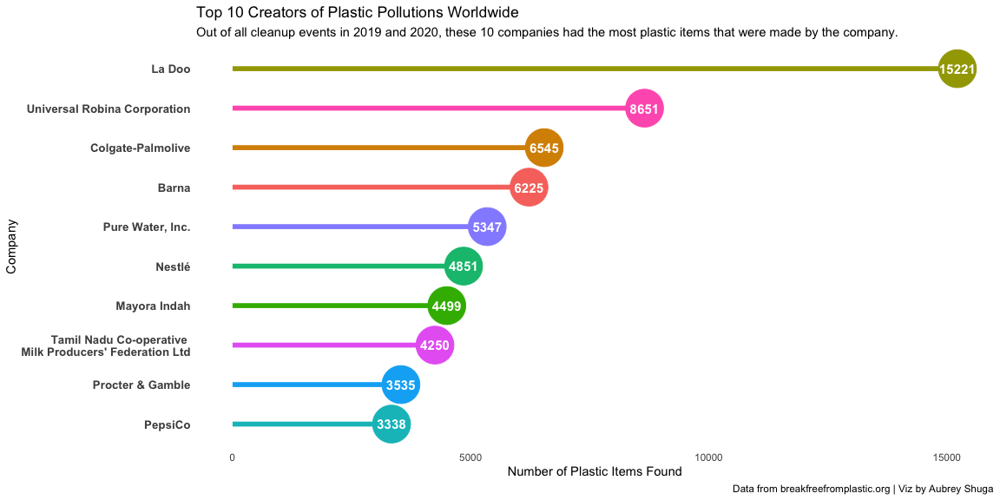

# Intro


```r
library(tidytuesdayR)
library(tidyverse)
library(knitr)
```

[blogpost](https://github.com/sarahsauve/TidyTuesdays/blob/master/BFFPDashboard/BlogPost.md)

[Challenge intro](https://github.com/rfordatascience/tidytuesday/blob/master/data/2021/2021-01-26/readme.md)

[data]()
[Tidy Tuesday](https://github.com/rfordatascience/tidytuesday)


# The Data

Tidy Tuesday provides the following code to load in the data:

```r
# Get the Data

# Read in with tidytuesdayR package 
# Install from CRAN via: install.packages("tidytuesdayR")
# This loads the readme and all the datasets for the week of interest

# Either ISO-8601 date or year/week works!

tuesdata <- tidytuesdayR::tt_load('2021-01-26')
tuesdata <- tidytuesdayR::tt_load(2021, week = 5)

plastics <- tuesdata$plastics

# Or read in the data manually

plastics <- readr::read_csv('https://raw.githubusercontent.com/rfordatascience/tidytuesday/master/data/2021/2021-01-26/plastics.csv')

```

Since there are a few options, I decided to use the tidytuesdayR package option. That way, I can work with any other Tidy Tuesday data without having to find the link. I just need to know the week number.


```r
#tuesdata <- tidytuesdayR::tt_load(2021, week = 5) #load in this week's data
```

`tuesdata` is a list where the first item is our dataframe, so we'll need to extract the plastics item from the list and save it.


```r
#plastics <- tuesdata$plastics #grab the plastics item from the list and save it as plastics (this is our data)
```


If we peek at the data, it looks like each row is a `country`-`year`-`parent_company` combination. This data only contains 2019 and 2020.


```r
plastics %>% head() %>% knitr::kable()
```


country      year  parent_company           empty   hdpe   ldpe     o    pet    pp    ps   pvc   grand_total   num_events   volunteers
----------  -----  ----------------------  ------  -----  -----  ----  -----  ----  ----  ----  ------------  -----------  -----------
Argentina    2019  Grand Total                  0    215     55   607   1376   281   116    18          2668            4          243
Argentina    2019  Unbranded                    0    155     50   532    848   122   114    17          1838            4          243
Argentina    2019  The Coca-Cola Company        0      0      0     0    222    35     0     0           257            4          243
Argentina    2019  Secco                        0      0      0     0     39     4     0     0            43            4          243
Argentina    2019  Doble Cola                   0      0      0     0     38     0     0     0            38            4          243
Argentina    2019  Pritty                       0      0      0     0     22     7     0     0            29            4          243

Tidy Tuesday also provides a Data Dictionary that explains each column in the dataset:

### Data Dictionary

The plastic is categorized by [recycling codes](https://en.wikipedia.org/wiki/Recycling_codes).

`plastics.csv`

|variable       |class     |description |
|:---|:---|:-----------|
|country        |character |Country of cleanup |
|year           |double    | Year (2019 or 2020) |
|parent_company |character | Source of plastic |
|empty          |double    | Category left empty count |
|hdpe           |double    | High density polyethylene count (Plastic milk containers, plastic bags, bottle caps, trash cans, oil cans, plastic lumber, toolboxes, supplement containers) |
|ldpe           |double    | Low density polyethylene count (Plastic bags, Ziploc bags, buckets, squeeze bottles, plastic tubes, chopping boards) |
|o              |double    | Category marked other count |
|pet            |double    | Polyester plastic count (Polyester fibers, soft drink bottles, food containers (also see plastic bottles) |
|pp             |double    | Polypropylene count (Flower pots, bumpers, car interior trim, industrial fibers, carry-out beverage cups, microwavable food containers, DVD keep cases) |
|ps             |double    | Polystyrene count (Toys, video cassettes, ashtrays, trunks, beverage/food coolers, beer cups, wine and champagne cups, carry-out food containers, Styrofoam) |
|pvc            |double    | PVC plastic count (Window frames, bottles for chemicals, flooring, plumbing pipes) |
|grand_total    |double    | Grand total count (all types of plastic) |
|num_events     |double    | Number of counting events |
|volunteers     |double    | Number of volunteers |


### Data Summary

We can use `skimr::skim()` to see a summary of the data, including the number of rows and columns, column types, and some summary stats for each column.


```r
skimr::skim(plastics) #print a summary of the data
```


Table: Data summary

                                    
-------------------------  ---------
Name                       plastics 
Number of rows             13380    
Number of columns          14       
_______________________             
Column type frequency:              
character                  2        
numeric                    12       
________________________            
Group variables            None     
-------------------------  ---------


**Variable type: character**

skim_variable     n_missing   complete_rate   min   max   empty   n_unique   whitespace
---------------  ----------  --------------  ----  ----  ------  ---------  -----------
country                   0               1     4    50       0         69            0
parent_company            0               1     1    84       0      10823            0


**Variable type: numeric**

skim_variable    n_missing   complete_rate      mean        sd     p0    p25    p50    p75     p100  hist  
--------------  ----------  --------------  --------  --------  -----  -----  -----  -----  -------  ------
year                     0            1.00   2019.31      0.46   2019   2019   2019   2020     2020  ▇▁▁▁▃ 
empty                 3243            0.76      0.41     22.59      0      0      0      0     2208  ▇▁▁▁▁ 
hdpe                  1646            0.88      3.05     66.12      0      0      0      0     3728  ▇▁▁▁▁ 
ldpe                  2077            0.84     10.32    194.64      0      0      0      0    11700  ▇▁▁▁▁ 
o                      267            0.98     49.61   1601.99      0      0      0      2   120646  ▇▁▁▁▁ 
pet                    214            0.98     20.94    428.16      0      0      0      0    36226  ▇▁▁▁▁ 
pp                    1496            0.89      8.22    141.81      0      0      0      0     6046  ▇▁▁▁▁ 
ps                    1972            0.85      1.86     39.74      0      0      0      0     2101  ▇▁▁▁▁ 
pvc                   4328            0.68      0.35      7.89      0      0      0      0      622  ▇▁▁▁▁ 
grand_total             14            1.00     90.15   1873.68      0      1      1      6   120646  ▇▁▁▁▁ 
num_events               0            1.00     33.37     44.71      1      4     15     42      145  ▇▃▁▁▂ 
volunteers             107            0.99   1117.65   1812.40      1    114    400   1416    31318  ▇▁▁▁▁ 

---

# Data Wrangling

The first step I'd like to take is renaming the columns using the information in the data dictionary. This will help me to remember what each column means.


```r
plastics_new <- plastics %>%
  rename("empty_count" = "empty",
         "high_density_polyethylene_count" = "hdpe",
         "low_density_polyethylene_count" = "ldpe",
         "other_count" = "o",
         "polyester_plastic_count" = "pet",
         "polypropylene_count" = "pp",
         "polystyrene_count" = "ps",
         "pvc_plastic_count" = "pvc",
         "total_plastic_count" = "grand_total", #I'm renaming this because there is also a country called "Grand Total" and I don't want to mix them up
         "times_counted" = "num_events")
  
  # #rename some values that are the same but have diff names
  # mutate(parent_company = gsub("estle", "estlé", parent_company),
  #        parent_company = gsub("PT Mayora Indah Tbk", "Mayora Indah", parent_company),
  #        parent_company = gsub("Pepsico", "PepsiCo", parent_company))
```

# Viz

I'm interested in which parent companies create the most plastic pollution.


```r
#I want to look at the top 10 `parent_company`s with the highest total `total_plastic_count` (of all countries and years)

#Create new dataframe to use for my plot
p_dat <- plastics_new %>% 
  
  #Get total `total_plastic_count` for each company
  group_by(parent_company) %>%
  summarise(total_plastic_count = sum(total_plastic_count)) %>%
  
  #Remove any parent_company where the name isn't actually 1 company 
  filter(!parent_company %in% c("null","NULL","Grand Total","Unbranded", "Assorted")) %>%
  
  #Keep the rows with the top 10 total_plastic_count values
  slice_max(order_by = total_plastic_count, n = 10) %>%
  
  #Turn all " " and "-" into "\n" to fit more on one line
  mutate(parent_company = gsub("Tamil Nadu Co-operative Milk Producers' Federation Ltd", "Tamil Nadu Co-operative \nMilk Producers' Federation Ltd", parent_company))
  

#Create my plot
p <- p_dat %>%
  ggplot() +
  
  #Add a point for each company's count
  geom_point(aes(y = reorder(parent_company, total_plastic_count),
                 x = total_plastic_count,
                 col = parent_company),
                size = 15) +
  
  #Add a line for each company (lollipop chart)
  geom_segment(aes(y = parent_company,
                   yend = parent_company,
                   x = 0,
                   xend = total_plastic_count,
                   col = parent_company),
                  size = 2) +
  
  geom_text(aes(y = reorder(parent_company, total_plastic_count),
                x = total_plastic_count,
                label = total_plastic_count),
            size = 4,
            col = "white",
            fontface = "bold") +
  
  #scale the y-axis on a log scale so the values aren't as spread out
  # scale_y_continuous(trans='log10', 
  #                    breaks = scales::trans_breaks("log10", function(x) 10^x),
  #                    labels = scales::trans_format("log2",
  #                                                  scales::math_format(10^.x))) +
  
  #Add all my labels
  labs(title = "Top 10 Creators of Plastic Pollutions Worldwide", 
       subtitle = "Out of all cleanup events in 2019 and 2020, these 10 companies had the most plastic items that were made by the company.",
       caption = "Data from breakfreefromplastic.org | Viz by Aubrey Shuga",
       y = "Company", 
       x = "Number of Plastic Items Found") +
  
  #All theme elements
  theme(legend.position ="none",
        panel.background = element_blank(), #remove gray background
        axis.text.y = element_text(face = "bold", size = 10), #no y-axis tick labels
        axis.ticks.y = element_blank(), #no y-axis tick marks
        axis.ticks.x = element_blank()) #no x-axis tick marks
p
```

<!-- -->

```r
#ggsave(plot = p, filename = file.path("iterations", paste0(Sys.time(),".png"))) #save each plot iteration so I can create a gif at the end
```


I think I want to add a point for each year. (Nevermind I gave up on this lol.)


